# Система бронирования аудиторий

Версия: учебная документация для Java CLI-приложения.

---

## Vision

Консольное Java-приложение для бронирования аудиторий в учебном заведении. Цель — продемонстрировать студентам ценность требований, анализа и дизайна. Поддержка ролей (STUDENT, ADMIN), работа с комнатами, создание/отмена броней, валидация времени, хранение in-memory.

---

## 1. Требования

### Функциональные

- FR1 — Аутентификация: вход по уникальному логину.
- FR2 — Список аудиторий: минимум 3 комнаты. (можно захардкодить)
- FR3 — Просмотр слотов по комнате/дате.
- FR4 — Создание брони.
- FR5 — Просмотр своих броней.
- FR6 — Отмена своей брони.
- FR7 — Admin: просмотр всех броней (только с ролью ADMIN).
- FR8 — Admin: отмена любой брони (только с ролью ADMIN).
- FR9 — Запрет брони в прошлом; end > start.

### Нефункциональные

- NFR1 — In-memory хранение.
- NFR2 — Интерфейс: CLI.
- NFR3 — Валидация и обработка ошибок.
- NFR4 — Репозитории через интерфейсы (подмена на БД возможна).

---

## 2. Acceptance Tests (AT)

- AT-1: `login <user>` → успешный логин или ошибка, если пользователь не существует.
- AT-2: `list-rooms` → вывод комнат.
- AT-3: `show-slots <roomId> <date>` → показывает свободные слоты.
- AT-4: `book <roomId> <start> <end>` → создаёт бронь, если валидно.
- AT-5: `my-bookings` → показывает брони пользователя.
- AT-6: `cancel <bookingId>` → отмена своей брони.
- AT-7: `all-bookings` (admin) → показывает все брони, только если роль ADMIN.
- AT-8: `admin-cancel <bookingId>` → отмена любой брони, только если роль ADMIN.

---

## 3. User Stories с CLI-примерами и диаграммами

### US-1: Login **Acceptance**: login alice → Logged in, иначе Unknown user. **CLI**:
```bash
> login alice
✅ Logged in as alice

> login unknown
❌ Unknown user
```

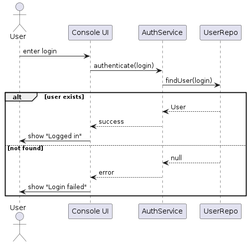

**Sequence**:
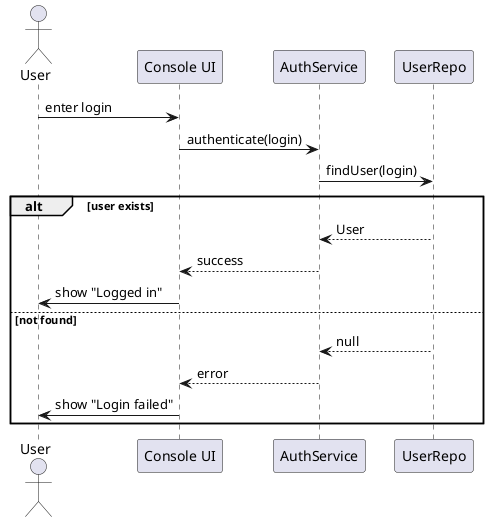

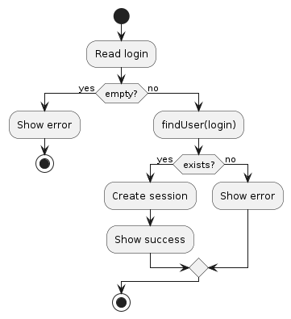
**Activity**:
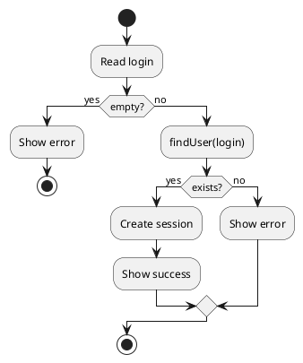

--- 

### US-2: View Rooms **Acceptance**: list-rooms → ≥ 3 комнаты. 
**CLI**:
```bash
> list-rooms
ROOMS:
  [1] Room A (capacity 20)
  [2] Room B (capacity 50)
  [3] Room C (capacity 10)
```
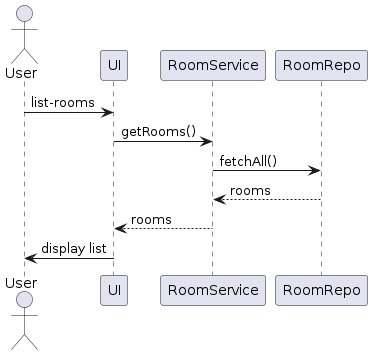
**Sequence**:
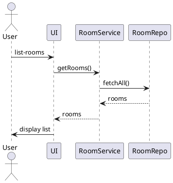

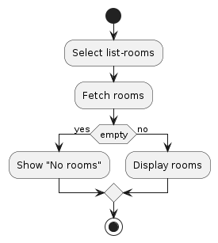
**Activity**:
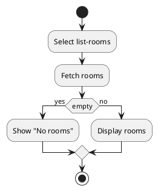

--- 
### US-3: View Slots 
**Acceptance**: show-slots 1 2025-10-07 → список свободных слотов. 

**CLI**:
```bash
> show-slots 1 2025-10-07
Room A schedule:
09:00-11:00 free
11:00-13:00 booked
13:00-15:00 free
```

**Sequence**:
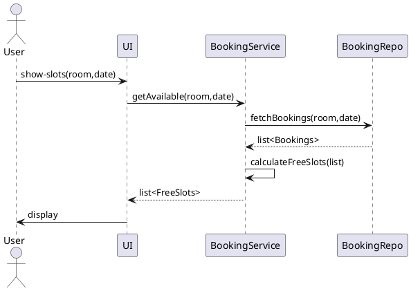

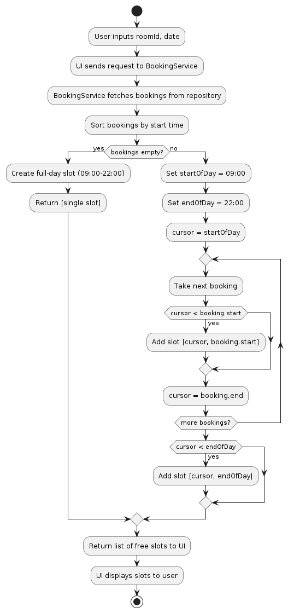

**Activity**:
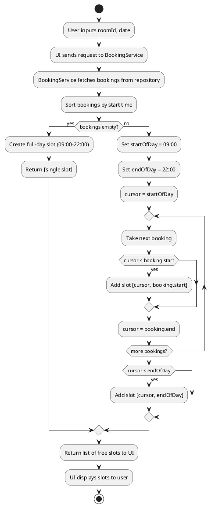
---

### US-4: Create Booking

**Acceptance**: `book 1 2025-10-07T09:00 2025-10-07T11:00` → создаётся, если нет конфликта.

**CLI**:

```bash
> book 1 2025-10-07T09:00 2025-10-07T11:00
✅ Booking created [id=42]

> book 1 2025-01-01T09:00 2025-01-01T11:00
❌ Cannot book in the past
```

**Sequence**:

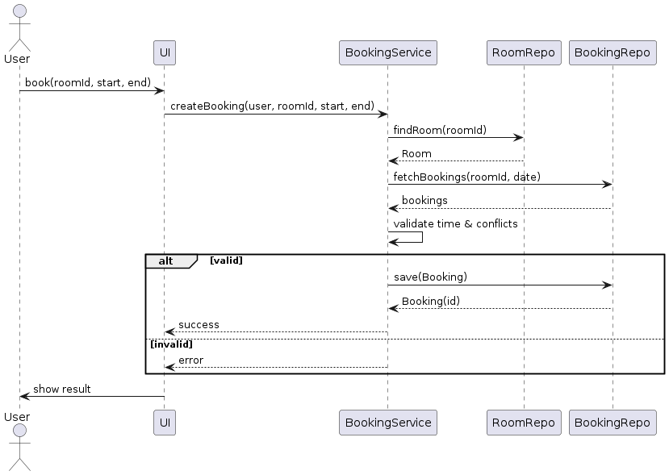

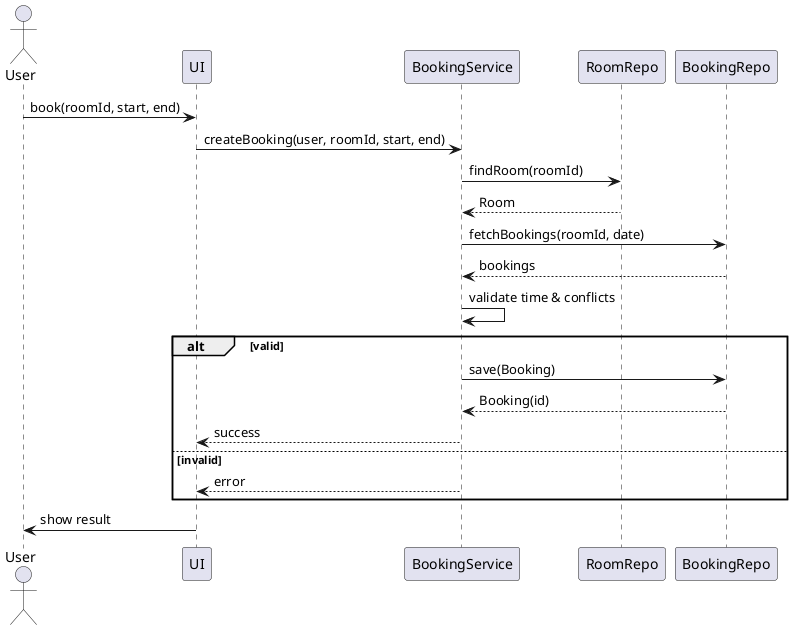

**Activity**:

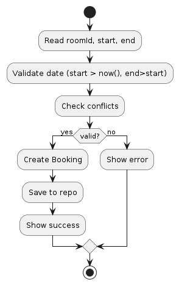

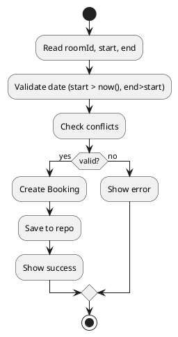

---

### US-5: My Bookings

**CLI**:

```bash
> my-bookings
Your bookings:
[42] Room A 2025-10-07 09:00-11:00 ACTIVE
```

**Sequence**:

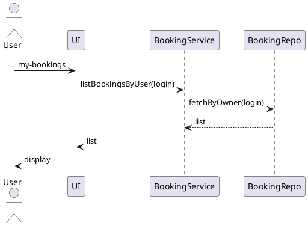

**Activity**:


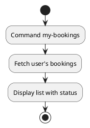

---

### US-6: Cancel Own Booking

**CLI**:

```bash
> cancel 42
✅ Booking 42 cancelled
```

**Sequence**:

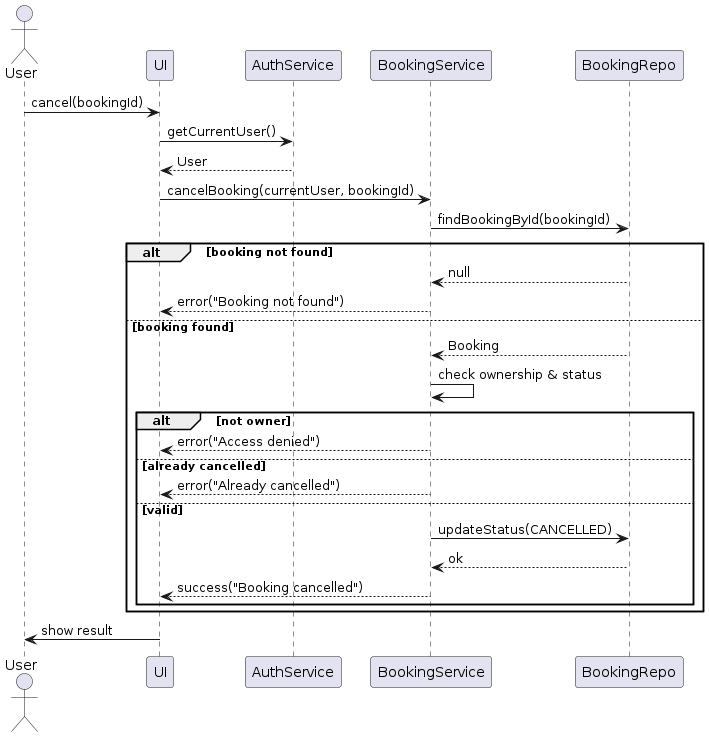
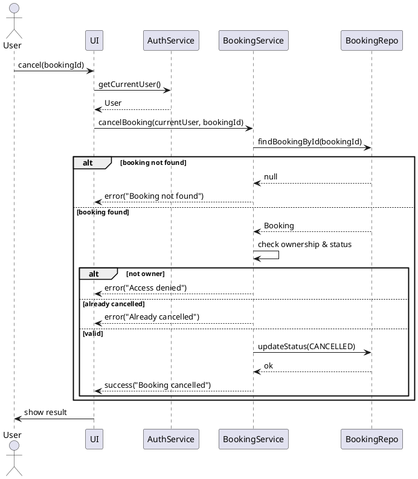

**Activity**:

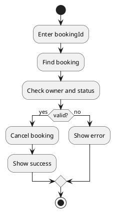

---

### US-7: Admin View All

**CLI**:

```bash
> all-bookings
ALL BOOKINGS:
[42] Room A by alice ACTIVE
[43] Room B by bob CANCELLED
```

**Sequence**:
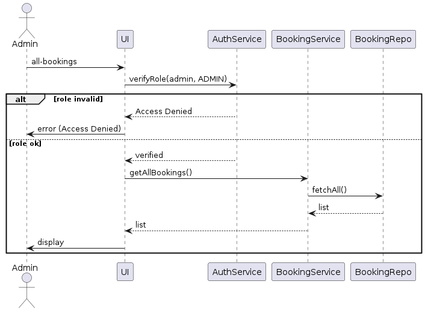

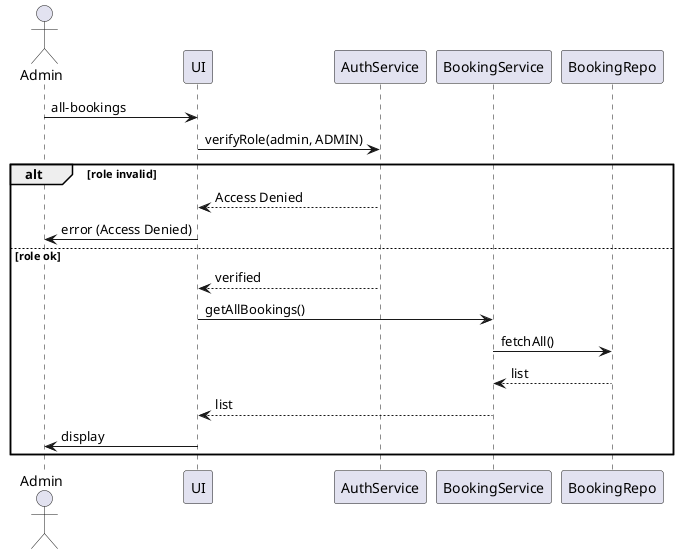

**Activity**:

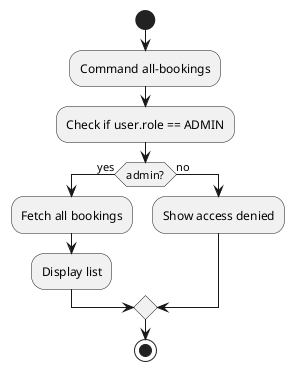

---

### US-8: Admin Cancel Any

**CLI**:

```bash
> admin-cancel 42
✅ Booking 42 cancelled by admin
```

**Sequence**:

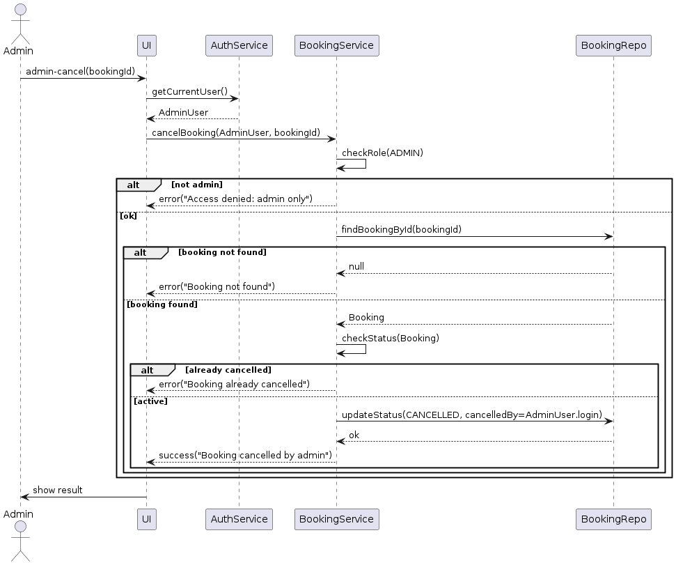

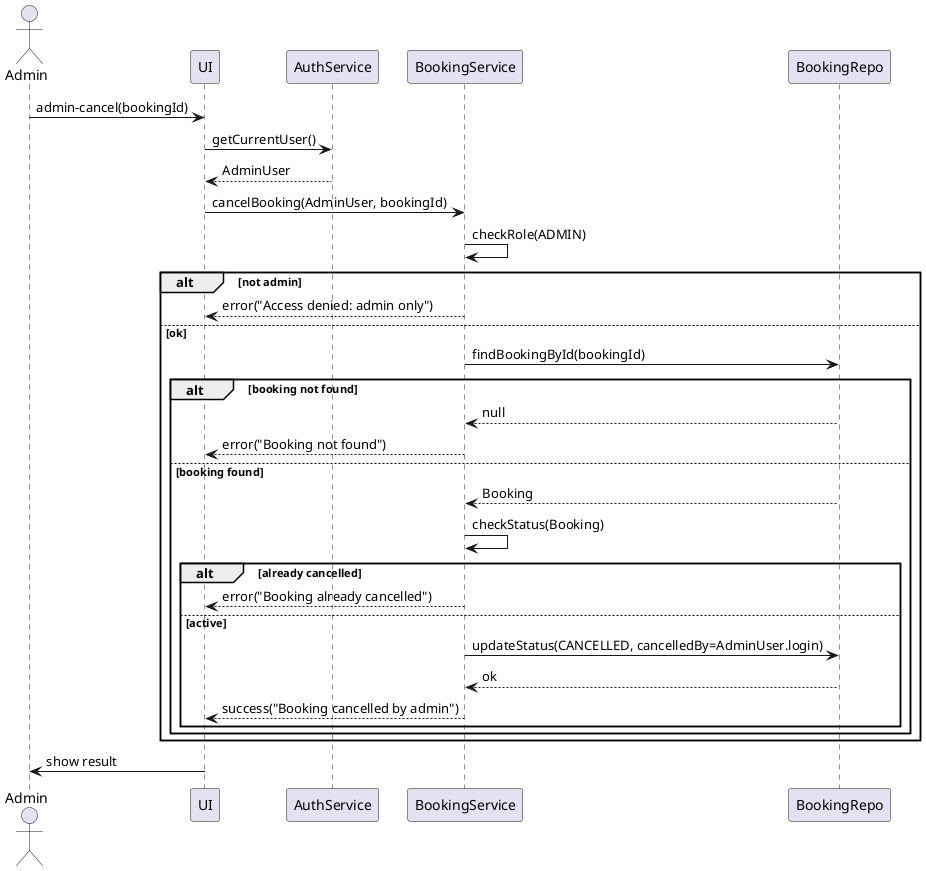

**Activity**:

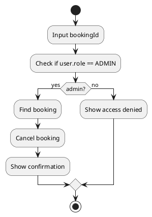

---

## 9. Диаграмма классов UI → Service → Repo → Domain

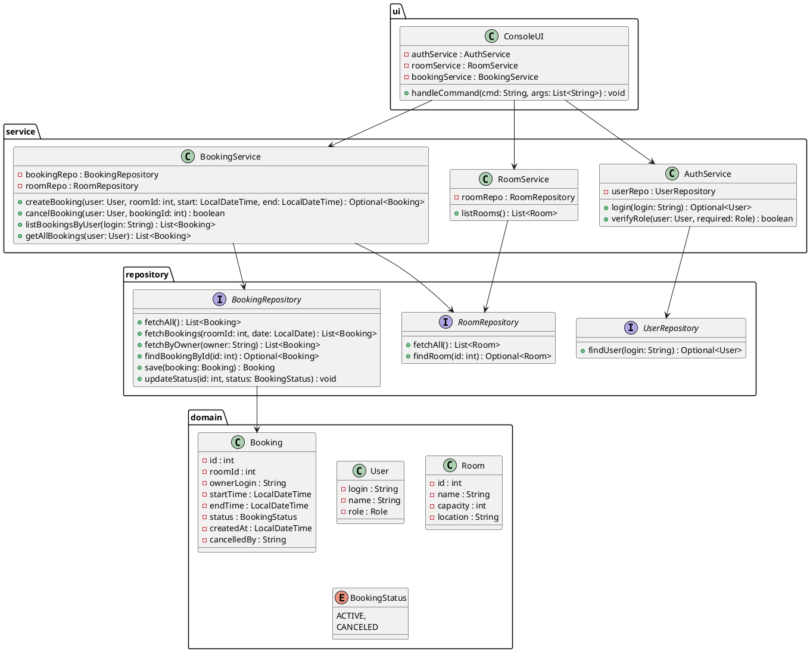

---

## 10. Архитектурные заметки

Добавлены уточнения в сервисы и репозитории:

- Репозитории возвращают Optional для безопасной обработки отсутствующих данных.
- BookingService проверяет роль пользователя перед вызовом административных методов.
- BookingService выполняет валидацию времени и конфликтов.
- ConsoleUI агрегирует сервисы и маршрутизирует команды.
- Domain слой не зависит от инфраструктуры.

---

# Конец документа
